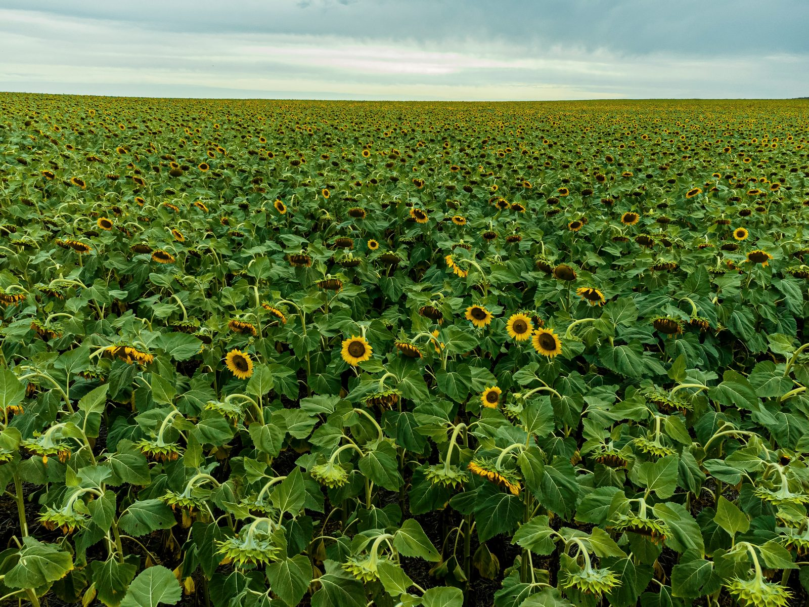
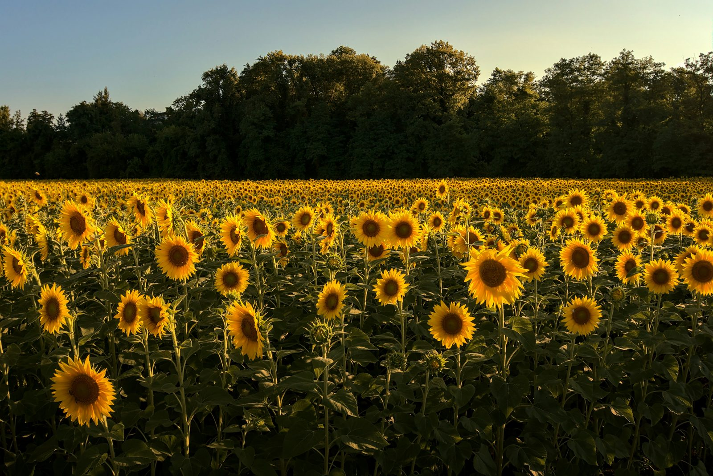

Соняшник — культура, для якої дата на календарі важить менше, ніж температура ґрунту на глибині загортання насіння. Орієнтуватись тільки на «традиційні» строки за регіоном — ризиковано: сезони відрізняються, і те, що спрацювало торік, може підвести цього року. У цій статті розберемо, як визначити правильний момент для сівби, чому і поспіх, і зволікання однаково шкодять урожаю, і як строк сівби пов'язаний з вибором конкретного гібрида з [каталогу соняшника](/catalog/sonyashnyk/).

## Температурний поріг

Насіння соняшника проростає вже за температури ґрунту близько **6–8°C** на глибині сівби, але дружні й швидкі сходи отримують ближче до **8–10°C**, стабільних, а не разових. Вимірювати варто вранці, кілька днів поспіль — одноразовий теплий день після холодної ночі ще нічого не гарантує.

Найпростіший спосіб виміряти — звичайний ґрунтовий термометр на глибині майбутньої сівби (зазвичай 6–8 см), зранку о приблизно однаковій годині, три-чотири дні поспіль. Якщо показник стабільно тримається на рівні 8°C і вище і прогноз на найближчий тиждень не обіцяє різкого похолодання — можна виходити в поле. Одна тепла днина після холодної ночі — це ще не стабільне прогрівання, а тимчасове коливання, яке легко зникає з першим же похолоданням.

Якщо термометра під рукою немає, орієнтовним індикатором служить стан ґрунту вранці: стабільно тепла земля без ранкової паморозі кілька днів поспіль — непрямий, але робочий сигнал. Проте це саме непрямий орієнтир, і при першій можливості варто перевірити температуру інструментально, а не покладатись тільки на відчуття.

## Чому не варто поспішати

Сівба «в холодний ґрунт» здається способом виграти час, але має зворотний ефект:

- **Насіння довше лежить у ґрунті до появи сходів** — це вікно для пошкодження шкідниками (дротяники, підгризаючі совки) і збудниками кореневих гнилей, які активніші саме у холодному вологому ґрунті.
- **Сходи виходять нерівномірно розтягнутими в часі**, що ускладнює подальші механізовані обробки — гербіцид чи міжрядний обробіток розраховані на певну фазу розвитку рослини, а розтягнуті сходи означають, що частина поля обробляється невчасно.
- **При поверненні заморозків** молоді сходи соняшника пошкоджуються сильніше, ніж ще непророслене насіння в ґрунті — насіння в стані спокою значно морозостійкіше за вже проклюнутий паросток.
- **Повільне проростання ослаблює рослину** ще до появи над поверхнею — витрачені запаси насінини не компенсуються повільним фотосинтезом на холоді, і сходи виходять фізіологічно слабшими навіть якщо зовні виглядають нормально.

## Чому не варто й затягувати

Пізня сівба зсуває цвітіння на спекотніший і посушливіший період, що б'є по заповнюваності кошика і збільшує ризик збігу цвітіння з максимальним тиском посухи в липні. Для гібридів з довшим вегетаційним періодом (за принципом, подібним до [шкали стиглості кукурудзи](/blog/yak-obraty-gibryd-kukurudzy-za-shkaloyu-fao/)) запізнення зі строком особливо помітне на врожайності.

Є ще один практичний наслідок пізньої сівби — зсув строків збирання на пізню осінь, коли погода менш стабільна, а вологість повітря вища. Це збільшує ризик втрат від намокання кошиків і ускладнює логістику збирання, особливо якщо у господарства кілька культур і техніка розписана по днях.

## Як строк сівби пов'язаний з вибором гібрида

Строк сівби — це не рішення саме по собі, а частина ширшого плану, куди входить і вибір гібрида. У [каталозі соняшника](/catalog/sonyashnyk/) представлені гібриди з різним вегетаційним періодом і під різні технології захисту, і це впливає на те, як ви плануєте вікно сівби:

**[«Лусон»](/product/sonyashnyk-luson/)** — найдовший вегетаційний період з чотирьох гібридів (115–120 днів), сумісний з технологіями Гранстар, SUMO та ExpressSun. Довший цикл означає менше запасу на затримку зі строком — якщо плануєте цей гібрид, орієнтуватись на раннє, але температурно безпечне вікно сівби особливо важливо.

**[«Каскара»](/product/sonyashnyk-kaskara/)** і **[«Ласса»](/product/sonyashnyk-lassa/)** — вегетаційний період 105–110 днів, що дає трохи більше гнучкості зі строком порівняно з «Лусоном». «Ласса» додатково працює за технологією Clearfield (Євролайтнінг), яка вимагає точного узгодження строку гербіцидної обробки з фазою розвитку бур'янів — це ще один аргумент планувати сівбу заздалегідь, а не орієнтуючись на «як складеться».

**[«Набаро»](/product/sonyashnyk-nabaro/)** — найкоротший цикл (105 днів) серед гібридів каталогу, класична технологія без прив'язки до конкретного гербіциду. Найбільш гнучкий варіант, якщо строки сівби через погоду вже зсунулись пізніше запланованого.

Якщо ваше господарство традиційно стикається з пізньою весняною вологою чи нестабільним прогріванням ґрунту, має сенс закладати це в підбір гібрида ще на етапі закупівлі насіння, а не підлаштовувати сівбу під гібрид, обраний без урахування цього фактора.

## Орієнтовне вікно по регіонах

Це загальні орієнтири, не жорсткі дати — звіряйте з фактичним прогрівом ґрунту у вашому конкретному сезоні:

- **Степ:** зазвичай перша-друга декада квітня. Ґрунт тут прогрівається швидше через нижчу вологоємність і більш ранню весну, але посушливість другої половини літа — додатковий аргумент не затягувати.
- **Лісостеп:** середина-кінець квітня. Найбільш «усереднена» зона за строками, де відхилення в обидва боки залежать переважно від конкретного сезону.
- **Полісся й північні райони:** кінець квітня — початок травня, ґрунт прогрівається пізніше через вищу вологість і менше сонячної інсоляції навесні.

## Як оцінити готовність поля, а не тільки погоду

Температура ґрунту — головний, але не єдиний критерій. Перед виходом у поле варто оцінити ще кілька речей, які на практиці впливають на результат не менше за градуси.

**Фізична стиглість ґрунту.** Візьміть жменю ґрунту з глибини майбутньої сівби і стисніть у руці. Якщо він розсипається на грудки після стиснення — ґрунт фізично стиглий і готовий до обробітку. Якщо мажеться й ліпиться — рано, навіть якщо термометр показує потрібну температуру: техніка при такому стані ґрунту ущільнює його замість розпушення, і це шкодить сходам більше, ніж кілька зайвих днів очікування.

**Вирівняність поля.** Нерівне поле означає нерівну глибину загортання насіння сівалкою — частина насіння опиниться надто глибоко, частина надто мілко. Обидва варіанти розтягують сходи в часі так само, як і холодний ґрунт.

**Стан насіннєвого ложа після попередника.** Кількість пожнивних решток впливає на швидкість прогрівання ґрунту навесні — поле з великою кількістю стерні прогрівається повільніше, тому може знадобитись на кілька днів більше терпіння порівняно з чистим після просапної культури полем поруч.

**Наявність вологи саме на глибині загортання.** Верхній шар ґрунту може виглядати сухим, а на глибині 6–8 см вологи цілком достатньо для проростання — і навпаки. Перевіряйте вологість саме на робочій глибині сівалки, а не візуально по поверхні.

## Практичний чекліст перед сівбою

1. **Виміряйте температуру ґрунту** на глибині 8–10 см кілька днів поспіль, зранку, в один і той самий час.
2. **Перевірте прогноз на 5–7 днів наперед** — різке похолодання одразу після сівби небажане, навіть якщо на момент сівби ґрунт вже прогрітий.
3. **Оцініть вологозабезпеченість** — надто пересушений верхній шар так само шкодить дружності сходів, як і холод; в обох випадках насіння довго чекає на умови для проростання.
4. **Узгодьте глибину загортання з типом ґрунту**: на важких ґрунтах — мілкіше (4–5 см), на легких і пересихаючих — трохи глибше (6–8 см), до вологого шару.
5. **Звірте технологію захисту з обраним гібридом** — якщо йдете за Clearfield чи Гранстар-технологією, гербіцидна програма має бути готова заздалегідь, а не підбиратись постфактум.

## Часті запитання

**Чи можна сіяти соняшник у ще не повністю прогрітий ґрунт, якщо прогноз обіцяє тепло?**
Ризиковано. Прогноз на кілька днів наперед не завжди справджується, а насіння в холодному ґрунті вже вразливе до шкідників і гнилей у момент сівби. Краще почекати фактичного, а не прогнозованого прогрівання.

**Що робити, якщо весна затяжна і холодна, а оптимальне вікно сівби здається закритим?**
Розгляньте гібрид з коротшим вегетаційним періодом — це дає більше гнучкості зі строком без надмірного ризику для дозрівання восени. Порівняти вегетаційні періоди можна на сторінках товарів у [каталозі соняшника](/catalog/sonyashnyk/).

**Чи впливає попередник у сівозміні на строк сівби соняшника?**
Опосередковано — через залишкову вологу в ґрунті та швидкість його прогрівання. Поле після просапних культур з меншою кількістю рослинних решток прогрівається зазвичай швидше, ніж після зернових колосових з великою стернею.

**Наскільки критична різниця в кілька днів зі строком сівби?**
У межах оптимального температурного вікна — некритична. Але за межами цього вікна, в будь-який бік, кожен зайвий день збільшує або ризик пошкодження сходів холодом, або ризик зсуву цвітіння на пік посухи.

**Чи можна орієнтуватись на строки сівби кукурудзи як на приблизний орієнтир для соняшника?**
Частково — обидві культури чутливі до температури ґрунту, і на одному полі вікна сівби зазвичай перетинаються. Але соняшник трохи менш вимогливий до тепла на старті (проростає вже за 6–8°C, тоді як кукурудза потребує ближче до 10°C), тому оптимальне вікно для соняшника часто відкривається на кілька днів раніше. Детальніше про підбір гібрида кукурудзи — у статті [«Як обрати гібрид кукурудзи за шкалою ФАО»](/blog/yak-obraty-gibryd-kukurudzy-za-shkaloyu-fao/).

**Чи варто орієнтуватись на сусідні господарства, які вже почали сівбу?**
Це корисний, але не остаточний орієнтир. У сусіда може бути інший тип ґрунту, інша експозиція поля чи інший попередник у сівозміні — усе це впливає на швидкість прогрівання. Використовуйте чужий досвід як сигнал перевірити власне поле, а не як команду діяти негайно.

## Підсумок

Строк сівби соняшника — це баланс між «не застудити» і «не спізнитись у спеку». Орієнтир на температуру ґрунту, а не на календарну дату, дає точніший результат у будь-який конкретний рік. А вибір гібрида з підходящим вегетаційним періодом та сумісною технологією захисту — це те, що варто продумати ще до початку весняних робіт, а не під час них. Порівняти гібриди соняшника за повними характеристиками можна в [каталозі](/catalog/sonyashnyk/), а для підбору під ваш конкретний регіон — залишити заявку на сторінці [контактів](/contacts/).
