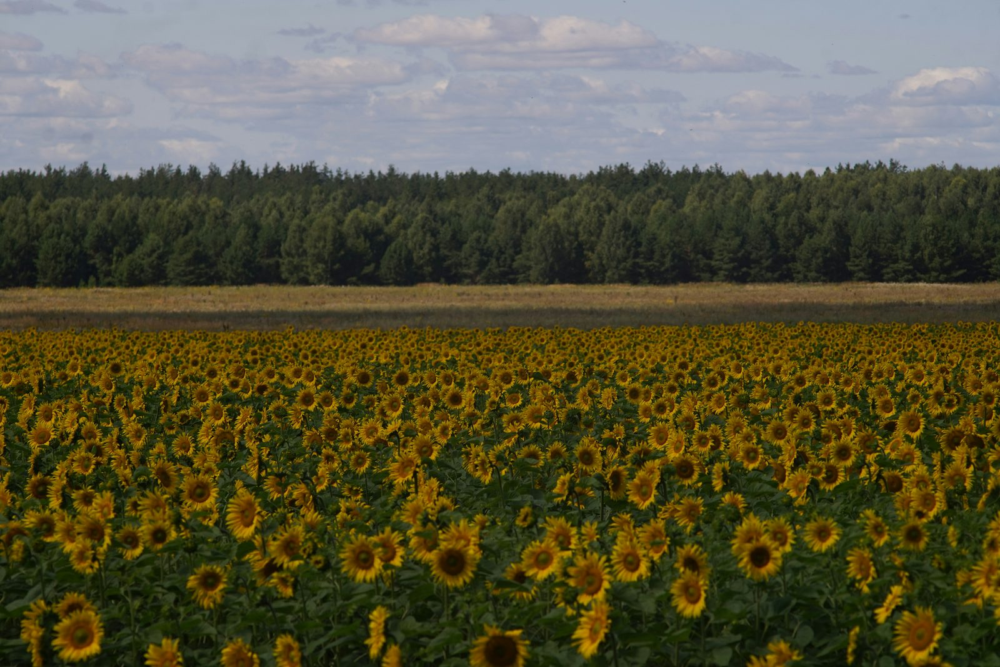
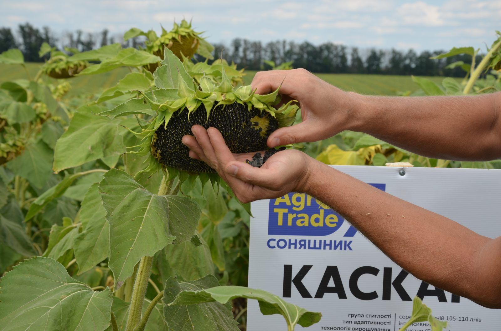
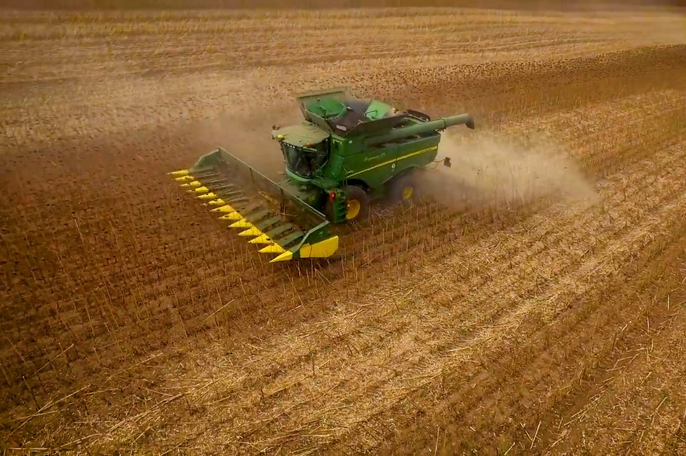

Строк збирання визначає врожай не менше, ніж строк сівби чи вибір гібрида, — але про нього говорять рідше. Занадто раннє збирання означає високу вологість зерна і зайві витрати на сушіння, занадто пізнє — втрати від осипання, вилягання та непередбачуваної осінньої погоди. У цій статті розберемо, як визначити правильний момент для жнив кукурудзи й соняшника та як вибір гібрида з [каталогу](/catalog/) впливає на це рішення.

## Ознаки стиглості кукурудзи

Фізіологічна стиглість зерна кукурудзи визначається появою **чорного шару** (black layer) — темної смужки в місці кріплення зерна до качана. Це означає, що приплив поживних речовин до зерна повністю зупинився, і подальше зростання маси зерна вже неможливе. На цьому етапі вологість зерна зазвичай становить 30–35% — це ще задовго до того, як поле готове до збирання комбайном.

Додаткові візуальні ознаки, які підтверджують наближення стиглості:

- обгортка качана втрачає зелений колір і стає світло-коричневою, сухою;
- верхівки зерен твердіють, при натисканні нігтем не продавлюються;
- молочна лінія (межа між рідкою і твердою частиною зерна при розрізі) зникає повністю.

Практично збирання починають, коли вологість зерна знижується до **20–25%** — за такої вологості механічні втрати при обмолоті вже прийнятні, а сушіння ще не надто витратне. Пряме комбайнування «до складу» без сушіння можливе тільки при вологості близько 14–15%, чого в польових умовах природним шляхом часто доводиться чекати аж до пізньої осені — тому більшість господарств сушать зерно штучно, а не чекають природного досушування на корені.

## Ознаки стиглості соняшника

Соняшник сигналізує про стиглість зміною кольору зворотного боку кошика: з зеленого через жовтий до бурого й коричневого. Коли зворотний бік кошика набуває характерного бурого відтінку, а більшість пелюсток вже опала, культура наближається до збиральної стиглості.

Насіння на цьому етапі має бути твердим, з характерним для гібрида забарвленням лушпиння (чорне, чорно-смугасте залежно від гібрида), і легко відділятись від кошика при легкому натисканні. Оптимальна вологість насіння для збирання — **8–10%**: при вищій вологості зростають втрати від забивання молотильного апарату, при нижчій — збільшується частка розколотого й травмованого насіння, а також ризик осипання просто на полі під час самого проходу комбайна.

Для прискорення й вирівнювання дозрівання поширена практика **десикації** — обробки препаратом, що штучно прискорює усихання рослини. Це особливо доцільно за нерівномірних сходів чи затяжної вологої погоди наприкінці вегетації, коли природне дозрівання розтягується в часі й ускладнює планування збирання.

## Чому не варто поспішати

- **Висока вологість зерна означає зайві витрати на сушіння** — кожен відсоток вологості понад базовий поріг зберігання коштує реальних грошей і часу роботи сушарки.
- **Незріле зерно механічно пошкоджується сильніше** при обмолоті — розколоте чи травмоване зерно гірше зберігається і має нижчу товарну якість.
- **Вологе зерно активніше вражається пліснявою на зберіганні**, особливо якщо сушіння відкладається через завантаженість сушарки в пікові дні жнив.

## Чому не варто й затягувати

- **Соняшник осипається** — чим довше стиглі кошики стоять у полі, особливо під вітром і дощем, тим більше насіння втрачається на землю ще до проходу комбайна. Це один з найбільш «непомітних» видів втрат урожаю, бо він не видно в бункері, а тільки в недоборі результату.
- **Кукурудза вилягає** — пізньостиглі гібриди з важкими качанами і ослабленим до кінця сезону стеблом ризикують поляганням від вітру, що різко ускладнює й уповільнює збирання, а частину врожаю комбайн просто не підбирає з землі.
- **Погода восени менш передбачувана** — з кожним тижнем зволікання зростає ризик затяжних дощів, які не лише зупиняють жнива на дні чи тижні, а й піднімають вологість зерна назад, зводячи нанівець природне підсихання.

## Як вибір гібрида впливає на планування збирання

Строк і послідовність збирання можна частково спланувати ще на етапі закупівлі насіння — вибором гібридів з різною групою стиглості та різною стійкістю до втрат при затримці.

**Кукурудза.** Три гібриди в [каталозі кукурудзи](/catalog/kukurudza/) мають різну групу ФАО — [«Ангора» (270)](/product/kukurudza-angora-fao-270/), [«Самарія» (300)](/product/kukurudza-samariya-fao-300/) і [«Сігірія» (350)](/product/kukurudza-sigiriya-fao-350/). Якщо посіяти всі три на різних полях, збирання природно розтягується в часі за групами стиглості — це знижує пікове навантаження на комбайн і сушарку порівняно з ситуацією, коли все поле дозріває одночасно. Детальніше про логіку вибору групи ФАО — у статті [«Як обрати гібрид кукурудзи за шкалою ФАО»](/blog/yak-obraty-gibryd-kukurudzy-za-shkaloyu-fao/).

**Соняшник.** У [каталозі соняшника](/catalog/sonyashnyk/) гібриди [«Ласса»](/product/sonyashnyk-lassa/) та [«Набаро»](/product/sonyashnyk-nabaro/) мають явно вказану **високу стійкість до осипання** у своїй специфікації. Для господарства це означає більший запас часу — навіть якщо через завантаженість техніки чи погоду збирання зсувається на кілька днів пізніше оптимального, втрати від осипання залишаються керованими. Це варто враховувати ще на етапі підбору гібрида, якщо у господарства велика площа і фізично неможливо зібрати все за один-два дні.

## Налаштування комбайна під фактичну вологість

Оптимальні ознаки стиглості на полі — це тільки половина справи, друга половина — налаштування техніки під фактичний стан культури в конкретний день, а не за загальними табличними значеннями.

**Для кукурудзи** ключове — швидкість обертання молотильного барабана і зазор деки. При підвищеній вологості зерна швидкість зазвичай знижують, а зазор дещо збільшують, щоб зменшити частку травмованого і розколотого зерна. При зниженні вологості до оптимальних значень налаштування можна повертати до стандартних, інакше є ризик недомолоту.

**Для соняшника** важливо стежити за втратами за жаткою і за молотаркою окремо — це різні джерела втрат, і компенсуються вони по-різному. Втрати за жаткою частіше пов'язані зі швидкістю руху й висотою зрізу, втрати за молотаркою — з налаштуванням обертів і зазорів під конкретну вологість і розмір насіння поточного гібрида.

Періодична перевірка бункера й огляд стерні на предмет втраченого зерна безпосередньо під час збирання — простий спосіб вчасно помітити, що налаштування потребує корекції, не чекаючи підсумкового звіту по врожайності в кінці жнив.

## Практичний чекліст перед виходом у поле

1. **Перевірте вологість зерна вологоміром** на кількох точках поля — вологість може відрізнятись навіть у межах одного масиву залежно від мікрорельєфу.
2. **Огляньте кошики соняшника чи качани кукурудзи візуально** — колір зворотного боку кошика, стан обгортки качана, твердість зерна.
3. **Оцініть стан стебла** — ознаки вилягання чи ламкості стебла сигналізують, що зволікати далі ризиковано незалежно від вологості зерна.
4. **Звірте прогноз погоди на найближчий тиждень** — навіть за прийнятної вологості варто встигнути зібрати урожай до тривалих опадів.
5. **Розставте пріоритети між полями**, якщо культур і гібридів кілька — починайте з ділянок із найвищим ризиком втрат (слабша стійкість до осипання чи вилягання, більш стиглі партії).

## Часті запитання

**Чи можна визначити стиглість кукурудзи без вологоміра?**
Приблизно так, за чорним шаром і кольором обгортки, але точну вологість без вологоміра не визначити. Для рішення про день виходу комбайна в поле точковий вимір вологоміром надійніший за візуальну оцінку.

**Що робити, якщо погода псується, а зерно ще занадто вологе?**
Зважте вартість дострокового збирання з подальшим сушінням проти ризику втрат від негоди чи полягання. Для гібридів із високою стійкістю до вилягання й осипання, як «Сігірія» чи «Ласса» з нашого каталогу, можна дозволити собі почекати на краще вікно погоди.

**Чи впливає група ФАО кукурудзи на строк збирання?**
Так, напряму — пізніші гібриди в межах одного поля дозрівають пізніше за ранні. Якщо у вас кілька гібридів різної групи стиглості, збирання природно розтягується в часі, що зменшує навантаження на комбайн в один конкретний тиждень.

**Наскільки критична різниця в кілька днів із початком збирання соняшника?**
Для стійких до осипання гібридів — некритична. Для гібридів зі слабшою стійкістю кожен зайвий день після настання стиглості, особливо з вітром і дощем, збільшує втрати насіння на землю.

**Чи можна прискорити дозрівання штучно?**
Для соняшника поширена практика десикації — обприскування препаратом, що прискорює усихання рослини й вирівнює стиглість по полю. Для кукурудзи штучне прискорення дозрівання не практикується, тут працює лише правильний вибір групи ФАО під сезон заздалегідь.

## Підсумок

Строк збирання — це така сама послідовність рішень, як строк сівби чи вибір гібрида, тільки на іншому кінці сезону. Орієнтуйтесь на фактичну вологість зерна й візуальні ознаки стиглості, а не на календар, і враховуйте стійкість конкретного гібрида до вилягання й осипання при плануванні черговості полів. Порівняти гібриди кукурудзи та соняшника за повними характеристиками можна в [каталозі](/catalog/), а для консультації з агрономом щодо конкретного поля — залишити заявку на сторінці [контактів](/contacts/).
