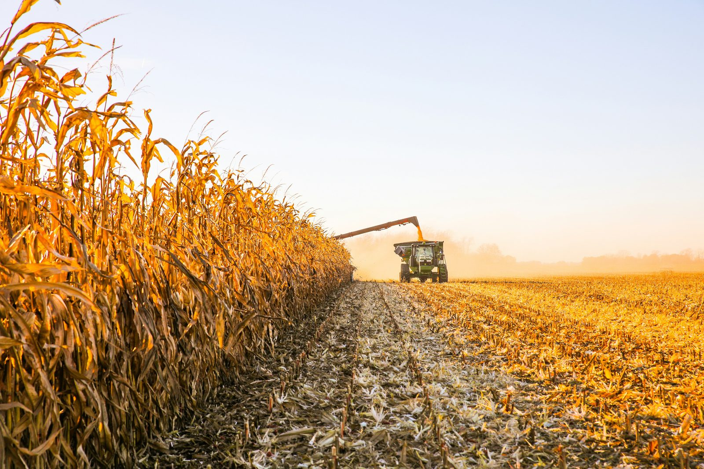
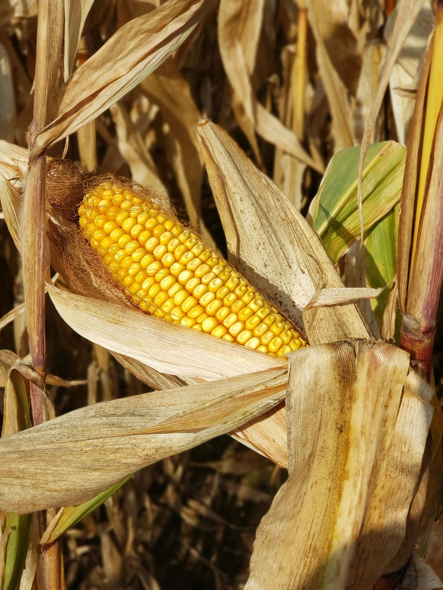
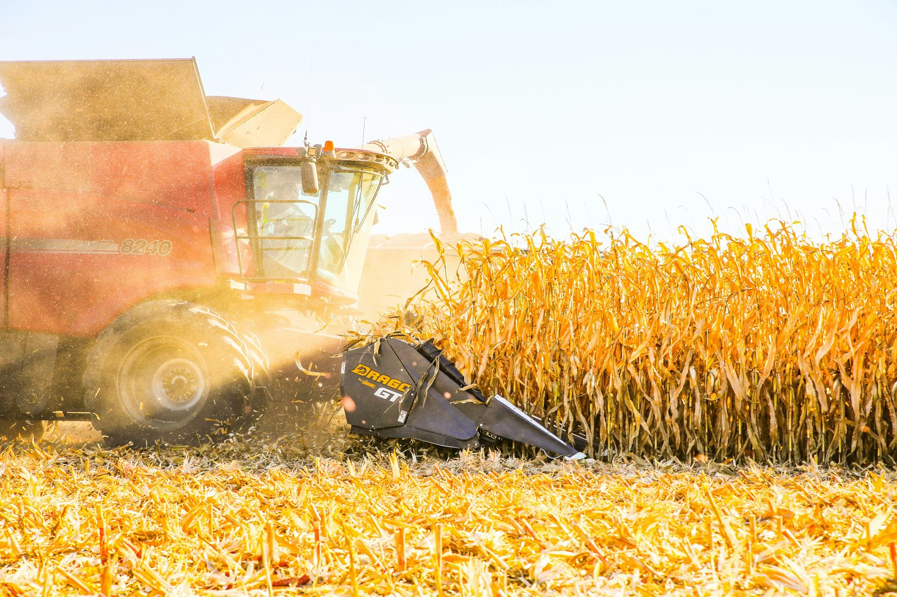

Коли на етикетці насіння написано «ФАО 250», це не оцінка якості й не маркетинговий бал. Це показник тривалості вегетаційного періоду гібрида, виражений через умовну шкалу, яку свого часу запропонувала Продовольча та сільськогосподарська організація ООН (Food and Agriculture Organization — звідси й назва). Чим вище число — тим довше гібриду треба часу від сходів до технічної стиглості. У цій статті розберемо, як читати цю шкалу практично, і на прикладі реальних гібридів з [каталогу кукурудзи](/catalog/kukurudza/) покажемо, як обрати варіант під конкретне поле.

## Що насправді означає число

Шкала ФАО для кукурудзи умовно ділиться на групи:

- **100–199** — ранньостиглі гібриди, 90–100 днів вегетації. Підходять для найкоротших сезонів — північні райони, Полісся, страхові посіви після пізньої весни.
- **200–299** — середньоранні й середньостиглі, 100–115 днів. Найширша група за поширеністю в Україні, підходить для більшості регіонів.
- **300–399** — середньопізні, 115–125 днів. Реалізують вищий потенціал урожайності там, де сезону вистачає з запасом — Лісостеп і Степ за нормальної вологозабезпеченості.
- **400 і вище** — пізньостиглі, понад 125 днів, для найтепліших регіонів з довгим безморозним періодом.

Це орієнтовні межі: реальна тривалість вегетації залежить ще й від суми ефективних температур конкретного сезону, а не тільки від номінальної групи. Два роки з однаковою календарною датою сівби можуть дати різну дату дозрівання одного й того ж гібрида — просто тому, що сума тепла за літо була різною.

## Чому «більше» не означає «краще»

Пізньостиглі гібриди зазвичай формують вищий потенціал урожайності — у них просто більше часу накопичити вегетативну масу й наповнити зерно. Але цей потенціал реалізується тільки якщо сезону вистачає з запасом. Якщо висіяти гібрид ФАО 350 у регіоні з коротким безморозним періодом, є ризик піти під заморозки з підвищеною вологістю зерна або взагалі не встигнути дозріти.

І навпаки: ранньостиглий гібрид у теплому регіоні з довгим сезоном «не добирає» урожайність, яку міг би дати пізніший гібрид на тій самій площі. Тому правильний підбір — це завжди компроміс між «встигнути дозріти» і «не залишити потенціал на полі».

## Приклад підбору на реальних гібридах

Щоб це не залишалось абстракцією, розберемо на трьох гібридах кукурудзи з нашого каталогу — вони навмисно різної групи стиглості, і різниця між ними якраз ілюструє логіку вибору.

**[«Ангора» (ФАО 270)](/product/kukurudza-angora-fao-270/)** — середньостиглий гібрид зернового напряму з високою холодостійкістю (9 з 10 балів), що дозволяє сіяти його раніше за конкурентів у тій самій групі стиглості. Це має значення там, де сезон обмежений з обох боків — і весняними заморозками, і осінньою вологою.

**[«Самарія» (ФАО 300)](/product/kukurudza-samariya-fao-300/)** — на одну підгрупу пізніше, зі стабільністю в різних кліматичних умовах і трохи вищою вологовіддачею (9 балів проти 8 у «Ангори»). Для господарства це означає нижчу вологість зерна на момент збирання — менше витрат на сушіння.

**[«Сігірія» (ФАО 350)](/product/kukurudza-sigiriya-fao-350/)** — найпізніший з трьох, універсального призначення (підходить і на зерно, і на силос). Формує найбільші качани з 18–20 рядами зерен, але вимагає найдовшого запасу тепла з трьох гібридів.

Якщо у вас, наприклад, Лісостеп із стабільним вологозабезпеченням і немає жорсткого обмеження за строками збирання — «Сігірія» реалізує вищий потенціал. Якщо поле в зоні з коротшим сезоном або після кукурудзи плануєте озимину і потрібно звільнити площу раніше — «Ангора» надійніша. «Самарія» — проміжний варіант, коли хочеться і запас урожайності, і прийнятну вологість зерна при збиранні. Повний перелік характеристик кожного гібрида — на сторінках товарів або в [каталозі кукурудзи](/catalog/kukurudza/) цілком.

## Як прив'язати вибір до свого поля

### 1. Порахуйте суму активних температур

Сума активних температур вашого регіону за останні 5–10 років (дані є в місцевих агрометеослужбах) — точніший орієнтир, ніж сама лише група ФАО. Виробник вказує вимоги гібрида до суми температур у детальних характеристиках; порівняйте цю цифру з вашою статистикою, а не покладайтесь тільки на номер ФАО.

### 2. Врахуйте дату можливих сходів

Пізня весна автоматично зсуває весь цикл і «з'їдає» запас часу навіть у номінально підходящого гібрида. Якщо у вашому регіоні сівба традиційно зсувається на пізніше через перезволоження ґрунту навесні, це варто закладати в підбір заздалегідь — краще взяти на групу нижче, ніж ризикувати з пізніми заморозками восени.

### 3. Плануйте під наступну культуру в сівозміні

Якщо після кукурудзи йде озима пшениця, важливо звільнити поле вчасно — це часто аргумент на користь дещо раннішого гібрида, навіть якщо запас температур дозволяє пізніший. Різниця в 10–15 днів між групами стиглості напряму впливає на дату збирання, а отже і на те, чи встигнете ви підготувати поле під озимину. Детальніше про ознаки стиглості й строки збирання — у статті [«Коли збирати кукурудзу та соняшник»](/blog/koly-zbyraty-kukurudzu-ta-sonyashnyk-oznaky-styglosti/).

### 4. Не ставте все на одну групу

Господарства, що сіють кукурудзу на кількох полях, часто свідомо беруть 2–3 гібриди різної стиглості — це розподіляє навантаження на збиральну техніку і знижує ризик втрат від одного погодного епізоду. Наприклад, комбінація раннього й середньопізнього гібрида дає ширше вікно для збирання і зменшує залежність від погоди в конкретний тиждень.

## Що ще дивитись окрім номера ФАО

Група стиглості визначає, коли гібрид дозріє. Але те, наскільки надійно він дійде до цього дозрівання без втрат, залежить від інших показників у специфікації — і їх варто читати разом із ФАО, а не окремо.

**Стійкість до посухи.** У наших трьох гібридах кукурудзи вона оцінена від 8 до 9 балів з 10 — різниця невелика, але в посушливий рік навіть один бал може означати різницю в кілька центнерів з гектара. Якщо ваше поле в зоні з нестабільними опадами в липні-серпні (критичний період для наливу зерна), варто віддавати перевагу верхній межі цього діапазону.

**Стійкість до вилягання.** Особливо важлива для пізніших і високорослих гібридів — наприклад, «Сігірія» з висотою рослин 230–240 см формує важчий качан, і стійкість стебла до вилягання напряму впливає на втрати при механізованому збиранні, особливо якщо збирання випадає на період із сильними вітрами.

**Стійкість до фузаріозу качана.** Фузаріоз — одна з головних причин зниження якості зерна на зберіганні, особливо в дощову другу половину вегетації. Всі три гібриди в каталозі мають стійкість 9 з 10, що знижує ризик, але не усуває потребу в профілактичному контролі вологості при зберіганні.

**Рекомендована густота посіву.** Вона різна для посушливої зони, зони нестійкого зволоження і зони достатнього зволоження — і це вже не про стиглість, а про те, скільки рослин на гектар дасть максимальний, а не надлишковий, результат для вашого водного балансу. Занизька густота недобирає потенціал, зависока — посилює конкуренцію за вологу в посушливий рік.

Усі ці показники — не додаток до ФАО, а частина того самого рішення. Гібрид з ідеально підходящою групою стиглості, але слабкою стійкістю до вилягання на вітряному полі, може розчарувати сильніше, ніж гібрид на групу «не той».

## Типові помилки при виборі за ФАО

- **Орієнтуватись лише на номер, ігноруючи суму температур.** Один і той самий номер ФАО в різних виробників може відповідати трохи різній реальній тривалості вегетації — завжди звіряйте з повною специфікацією гібрида.
- **Брати максимально пізній гібрид «про запас урожайності».** Без гарантованого запасу тепла це найчастіша причина підвищеної вологості зерна і додаткових витрат на сушіння.
- **Не враховувати мікроклімат конкретного поля.** Низовина з холодним повітрям навесні або схил південної експозиції можуть на тиждень-два зміщувати ефективний старт вегетації навіть у межах одного господарства.
- **Купувати насіння в останній момент без порівняння характеристик.** Стійкість до посухи, вилягання та фузаріозу різниться між гібридами навіть у межах однієї групи ФАО — це видно з таблиць характеристик на сторінці кожного товару.

## Часті запитання

**Чи можна визначити ФАО гібрида «на око», за зовнішнім виглядом рослини?**
Ні, група стиглості — це розрахунковий показник за сумою температур, а не за висотою чи виглядом рослини. Довіряйте лише офіційній специфікації виробника.

**Що робити, якщо в моєму регіоні складно знайти дані по сумі активних температур?**
Зверніться до найближчої агрометеостанції або обласного управління Держгідромету — ці дані є у відкритому доступі. Як орієнтир також підійде багаторічна практика сусідніх господарств: які групи ФАО там традиційно вирощують без проблем із дозріванням.

**Чи можна змішати два гібриди різної стиглості в одному полі?**
Технічно так, але це ускладнює догляд і збирання — вони дозріють у різний час. Краще висівати кожен гібрид на окремій ділянці чи полі, навіть якщо площі невеликі.

**Наскільки критична різниця в 20–30 одиниць ФАО?**
Це приблизно 3–5 днів різниці у вегетаційному періоді — не критично саме по собі, але може стати вирішальним у прикордонному за погодою сезоні. Саме тому варто дивитись не тільки на номер, а й на суму активних температур, яку вимагає конкретний гібрид.

**Чи можна орієнтуватись на групу ФАО сусіднього господарства, яке вже роками сіє тут кукурудзу?**
Так, це один з найпрактичніших орієнтирів — багаторічний досвід сусідів фактично підтверджує, які групи стиглості надійно дозрівають у вашому мікрокліматі. Але варто уточнити, чи не змінювали вони останнім часом технологію (наприклад, перехід на пізніші строки збирання через сушарку), інакше досвід може бути неповним.

**Чи впливає група ФАО на вибір густоти посіву?**
Опосередковано — так. Пізніші гібриди зазвичай формують більшу вегетативну масу і потребують дещо іншого балансу густоти залежно від вологозабезпечення зони, ніж ранні. Точні рекомендації завжди дивіться в специфікації конкретного гібрида, а не переносьте цифри з іншої групи стиглості.

## Практичний висновок

Група ФАО — перше, що варто дивитись у характеристиках гібрида, але не єдине. Вона працює разом із сумою активних температур вашого поля, датою сходів і місцем культури в сівозміні. Якщо є сумніви — краще звірити вибір з агрономом до закупівлі, а не після сівби. У [каталозі кукурудзи](/catalog/kukurudza/) можна порівняти всі три гібриди за повними характеристиками, а на сторінці [контактів](/contacts/) — залишити заявку на консультацію з підбором під ваше конкретне поле.
