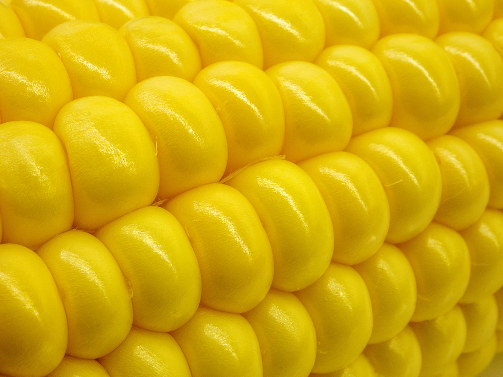
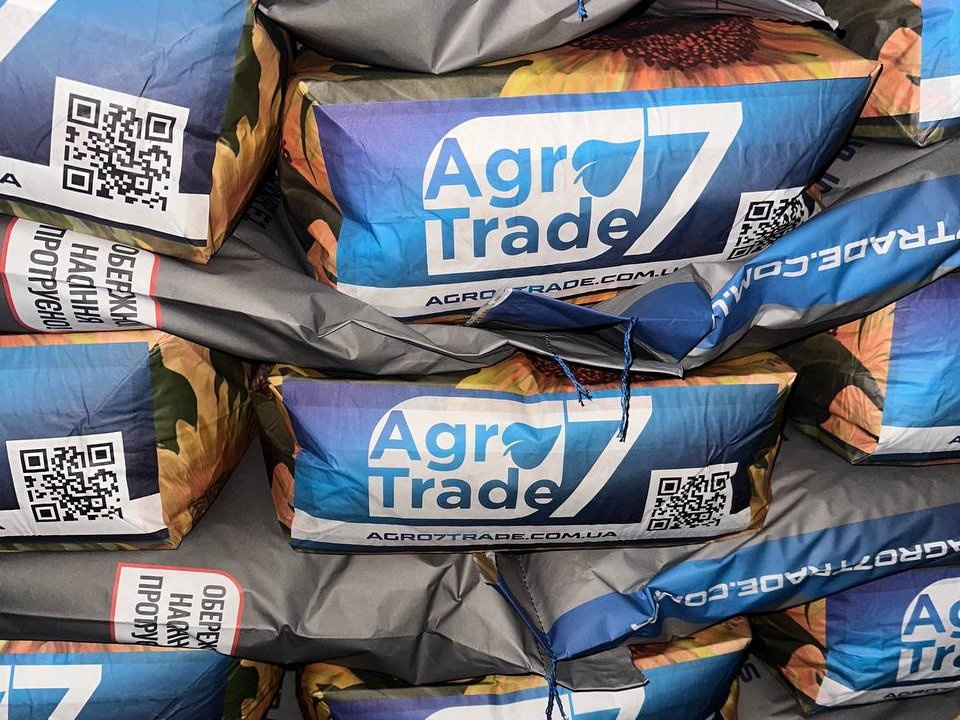
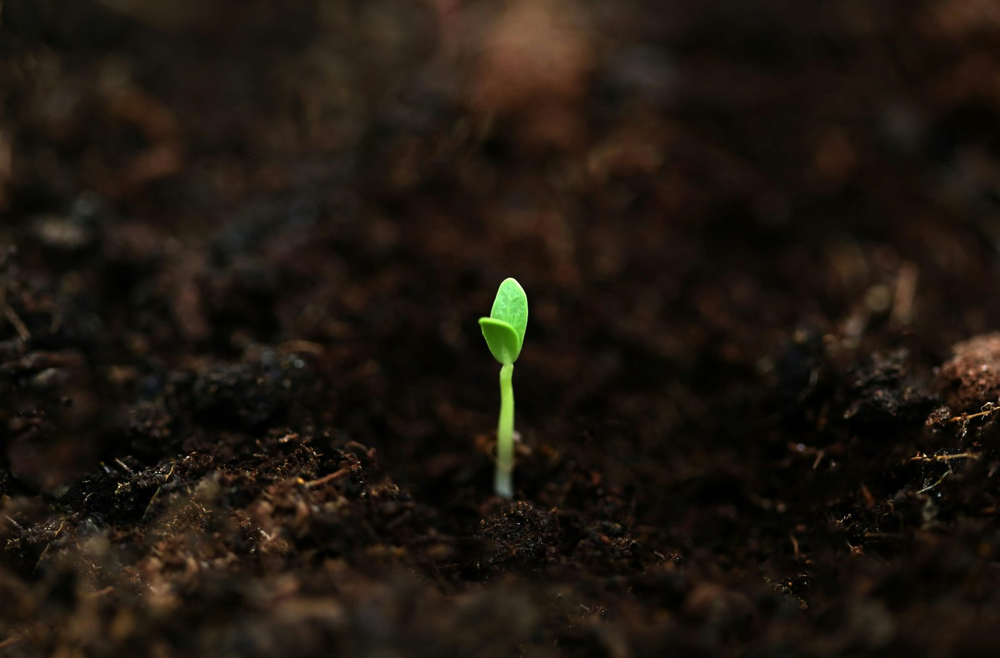

Насіння, яке восени виглядає ідеально, навесні може віддати в поле гірше, ніж очікували. Причина зазвичай не в самому гібриді й не в сівалці. Причина в тому, як насіння пролежало зиму. Схожість, тобто здатність дати дружні сходи, з часом знижується, і цей процес можна або сповільнити, або прискорити одними й тими самими діями.

Ця стаття про те, що саме треба контролювати між жнивами та сівбою: вологість, температуру, повітря, тару і перевірку схожості. Якщо коротко, зберігання насіння — це не складна наука, а дисципліна з кількома обов'язковими правилами.

## Чому насіння втрачає схожість

Насіння — жива частина рослини, навіть після збирання воно дихає. Поки воно сухе й прохолодне, дихання майже зупинено, і запаси поживних речовин витрачаються повільно. Коли зростають вологість або температура, дихання пришвидшується, вивільняється тепло і вологість, і процес сам себе підсилює. Саме так з'являються пліснява, слабкі сходи і втрата схожості ще до сівби.

Тому головне завдання складу — не допустити, щоб насіння почало «дихати» активніше за потрібне. Для цього є три важелі: вологість самого насіння, температура і вологість повітря навколо нього.

## Вологість насіння: найважливіший показник

Вологість насіння, яке закладаєте на зберігання, визначає більше, ніж будь-що інше. Насіння з вологістю вище за безпечний рівень починає псуватися навіть у хорошому складі.

Орієнтовні рівні, які найчастіше наводять для зберігання:

- **кукурудза:** близько 12–13%;
- **соняшник:** близько 7–9%.

Це орієнтири, а не закон. Точна цифра для вашої партії має бути в супровідних документах виробника. Якщо насіння довго лежало в вологому приміщенні або його привезли з жнив у мокрому стані, вологість варто перевірити вологоміром до того, як закладати на зберігання.

Соняшник тут вимогливіший. Його насіння багате на олію, і при підвищеній вологості воно швидко втрачає якість. Тому соняшник зазвичай тримають сухішим, ніж кукурудзу, і контролюють частіше.

## Температура: прохолодно і стабільно

Для тривалого зберігання найкраще працює прохолодне місце з рівною температурою. Орієнтир для більшості насіння — приблизно 10–15 °C. Складу, де температура стрибає від зими до тепла, слід уникати, бо кожен цикл охолодження і нагрівання створює умови для конденсату.

Важливо не тільки абсолютне значення, а й стабільність. Склад, який взимку промерзає, а після відлиги різко прогрівається, гірший за помірно прохолодний, але сталий. Поставте партії подалі від батарей, дверей, що часто відчиняються, і зовнішніх стін, які промерзають.

## Вологість повітря і вентиляція

Насіння набирає вологість з повітря, тому склад треба тримати сухим. Для більшості складів орієнтир — відносна вологість повітря близько 60–70%. Вище цього насіння починає відсирати, а особливо небезпечна ситуація, коли вологе повітря конденсується на холодних стінах і стелі.

Провітрювання допомагає, але воно має бути розумним. Відкрити вікна в сиру погоду — гірше, ніж не відкривати взагалі. Найкраще провітрювати в сухі й відносно прохолодні дні, а перед закладанням партій переконатися, що підлога і стіни сухі.

## Тара і розміщення

Насіння, яке довго лежить у поліетиленовому пакеті, часто псується. Поліетилен не пропускає повітря, тому будь-яка волога з насіння лишається всередині, а при перепадах температури на стінках пакета з'являється конденсат. Для довгого зберігання краще підходять:

- щільні мішки з тканини, які дозволяють повітрю циркулювати;
- спеціальна тара для насіння з вентиляційними отворами;
- мішки, поставлені на піддони, а не безпосередньо на підлогу.

Піддони з насінням не можна ставити впритул до стін. Між партіями і стіною має бути прохід, щоб було видно і зручно перевіряти стан мішків. Кожну партію варто підписати: культура, гібрид, рік, дата надходження, вологість за протоколом. Це зберігає порядок і дозволяє швидко знайти потрібне.

## Шкідники і гризуни

Склад для насіння — це ще й житло для комах і гризунів. Зернові шкідники можуть пошкодити зерно зсередини, а гризуни не тільки з'їдять частину партії, а й забруднять решту. Регулярний огляд допомагає помітити проблему вчасно.

Ознаки, на які варто звертати увагу:

- дрібні отвори в оболонці або пил під мішками;
- запах плісняви або кислуватий запах;
- тепле або злежане насіння всередині мішка;
- сліди гризунів і помет у кутах складу.

Якщо шкідник знайдений, партію не можна просто пересипати в інший мішок і залишити на місці. Її треба відсортувати, оглянути, а заражену частину вилучити. Відповідні засоби захисту обирайте з урахуванням того, що насіння призначене для сівби, і консультуйтеся з фахівцем.

## Як перевірити схожість перед сівбою

Навіть ідеальний склад не гарантує, що насіння за зиму не втратило схожості. Тому перевірка перед сівбою потрібна завжди. Є два способи.

Лабораторна перевірка дає точну відповідь. Протокол лабораторії показує відсоток схожості і чистоти партії. Його варто тримати разом із документами партії і порівнювати з тим, що було на момент отримання.

Домашній тест простіший і дає орієнтир. Візьміть кілька десятків зерен з різних мішків, покладіть їх між шарами вологого паперу або тканини в теплому місці, підтримуйте вологість і через кілька днів порахуйте, скільки з них пустили корінець. Чим більше зерен проросло, тим краще. Якщо результат помітно нижчий за очікуваний, норму висіву варто переглянути, щоб не отримати розріджені сходи.

Не чекайте останнього тижня перед сівбою, щоб зробити перевірку. Якщо результат поганий, часу на заміну партії або коригування норми вже не лишиться.

## Від жнив до закладання: що зробити в перші тижні

Найвідповідальніший момент — перші тижні після отримання партії. Саме тоді закладається якість, яка буде працювати весь зимовий період. Насіння, яке одразу потрапило у сухе прохолодне місце з контролем, часто тримається краще, ніж партія, яку «відкладають на потім» у теплому приміщенні.

Послідовність дій зазвичай така:

1. Перевірте документи партії: сорт або гібрид, рік, вологість і протокол чистоти та схожості.
2. Огляньте мішки. Пошкоджені, мокрі або відсирілі відкладіть окремо і не змішуйте з цілими.
3. За потреби доведіть насіння до безпечної вологості. Це треба робити ще до закладання, бо зберігання на вологому насінні тільки погіршує ситуацію.
4. Розмістіть партію на піддонах, підпишіть і внесіть у журнал.
5. Через тиждень-два повторно перевірте температуру і стан мішків, щоб переконатися, що все стабільно.

Такий простий порядок дій дає більше користі, ніж будь-яке дороге обладнання, якщо його не виконувати систематично.

## Як вести журнал партій

Журнал зберігання не потрібен для галочки. Він дає відповіді на питання, які інакше доводиться з'ясовувати навесні, коли часу вже немає. Записуйте для кожної партії:

- культуру, гібрид і номер партії;
- дату надходження і вологість на момент закладання;
- місце зберігання (стелаж, піддон, склад);
- дати оглядів, температуру і помітні зміни;
- результат перевірки схожості перед сівбою.

Якщо через рік зміниться норма висіву або постачальник, журнал покаже, як насіння поводилося в реальних умовах. Це найкращий аргумент при плануванні наступної закупівлі.

Орієнтовний приклад. Умовно, якщо з партії в 100 мішків при перевірці схожості втрачено кілька відсотків енергії проростання, норму висіву на гектар варто перерахувати з урахуванням цих втрат, а не сіяти за старою таблицею. Точні коефіцієнти залежать від вихідної схожості партії і строку зберігання, тому кожен господар має спиратися на власну перевірку.

## Коли зберігання вже не допоможе

Є ситуації, які ніяке зберігання не виправить. Якщо насіння спочатку мало низьку схожість, або його зібрали з великою вологістю і не встигли доглянути, втрати починаються ще до закладання. Тоді найкраще, що можна зробити, це одразу побачити проблему в протоколі й не сподіватися, що склад її вирішить.

Також важливо розуміти різницю між чистотою і схожістю. Партія може бути чистою від сміття і при цьому мати низьку енергію проростання. Тому в документах дивіться обидва показники, а не лише один.

## Типові помилки

Найчастіші помилки при зберіганні насіння повторюються з року в рік:

- закладати насіння з високою вологістю «потім висушимо», хоча вчасно висушити його вже не вдасться;
- тримати партії в пакетах, які не дають повітрю проходити;
- ставити мішки просто на бетонну підлогу біля стіни;
- не записувати, яка партія де лежить і коли її отримали;
- ігнорувати перевірку схожості до самого сезону.

Кожна з цих помилок окремо не виглядає критичною. Разом вони створюють умови, при яких навесні доводиться рахувати втрати.

## Часті запитання

Далі зібрані питання, які найчастіше ставлять перед початком зберігання.

### Яка вологість насіння кукурудзи безпечна для зберігання?

Для кукурудзи орієнтир — близько 12–13%. Чим довше зберігання, тим нижчою має бути вологість. Точну цифру для своєї партії вказано в протоколі виробника, її варто звірити перед закладанням на зберігання.

### Чому насіння соняшника псується швидше, ніж кукурудзи?

Насіння соняшника багате на олію і має тонку оболонку. Воно швидше окислюється та втрачає енергію проростання, тому його тримають сухішим, у прохолодному місці, без різких перепадів температури.

### Чи можна зберігати насіння в звичайному поліетиленовому пакеті?

Довго — ні. Поліетилен не дає повітрю циркулювати, а при перепадах температури на стінках утворюється конденсат. Для зберігання краще підійдуть щільні мішки з тканини або спеціальна тара, яка дихає, на піддонах від підлоги.

### Як перевірити схожість насіння перед сівбою в домашніх умовах?

Візьміть кілька десятків зерен, покладіть їх між вологими шарами паперу або тканини в теплому місці і через кілька днів порахуйте, скільки з них пустило корінець. Це орієнтовний тест. Для точного результату потрібна лабораторна перевірка.

### Коли варто перевіряти насіння, що лежить на складі?

Оглядайте партію щомісяця, а перед сівбою обов'язково перевірте схожість. Так видно, чи не почалось псування, чи не завелись шкідники, і чи вистачить норми висіву з урахуванням втрат.

## Підсумок

Зберігання насіння до весни тримається на трьох речах: сухе насіння, прохолодне стабільне місце і регулярний контроль. Якщо закласти партію з правильною вологістю, у тарі, яка дихає, і перевірити схожість до сівби, більшість проблем навесні просто не виникає.

Якщо плануєте сівбу 2027 року і хочете підібрати гібрид під свою зону, почніть з каталогу: [кукурудза](/catalog/kukurudza/) і [соняшник](/catalog/sonyashnyk/). Щоб зрозуміти, як строк збирання і вибір гібрида пов'язані між собою, дивіться статтю [про ознаки стиглості](/blog/koly-zbyraty-kukurudzu-ta-sonyashnyk-oznaky-styglosti/). Якщо залишились питання щодо зберігання конкретної партії, [напишіть нам](/contacts/), і ми допоможемо розібратися.
