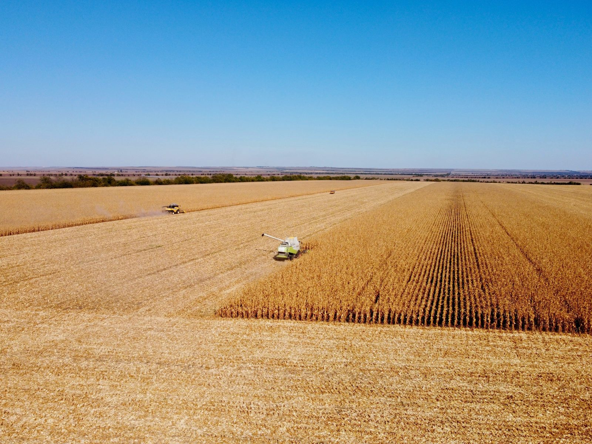
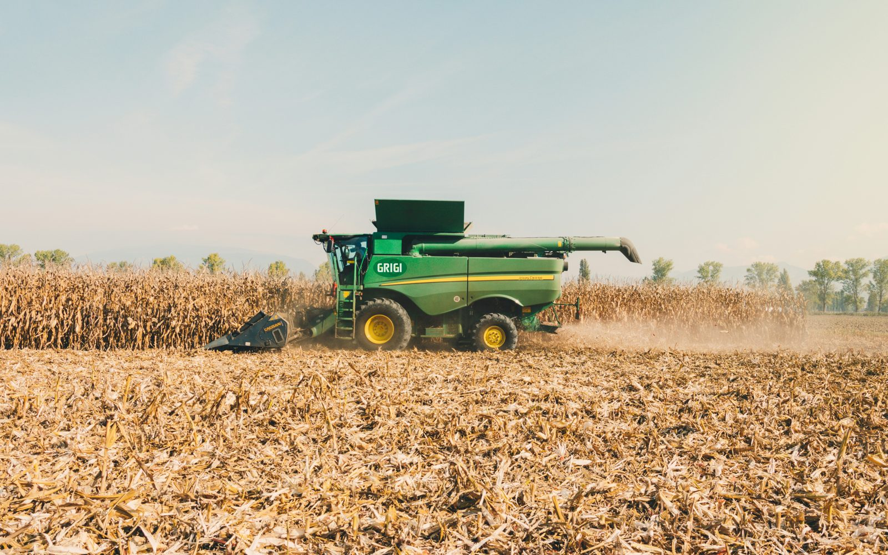
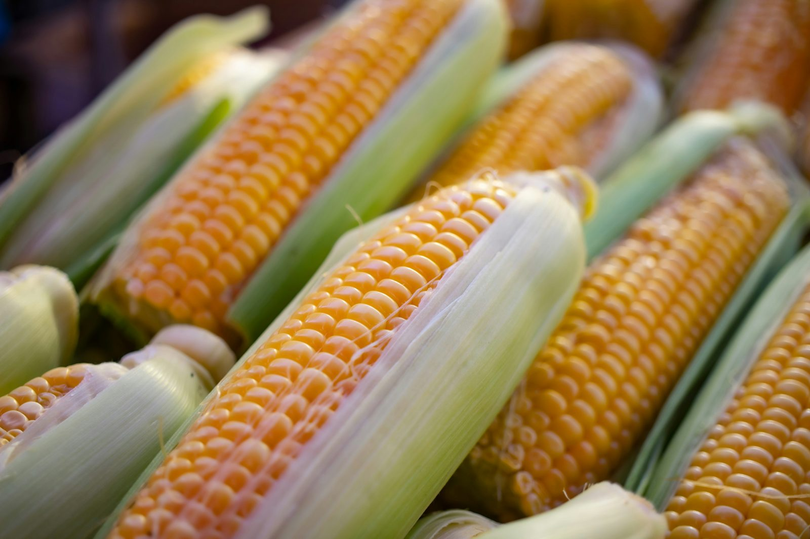

Вибір гібрида кукурудзи на наступний рік починається з простого запитання: під яку зону, яку тривалість вегетації і для чого потрібна кукурудза, на зерно чи на силос. Відповіді на ці питання визначають, який гібрид підійде, і жодна знижка не компенсує неправильно обраний ФАО.

У цій статті розбираємо три гібриди Agro7Trade: «Ангора», «Самарія» і «Сігірія». Кожен має свою нішу, і кожен стоїть на різному рівні тепла. Окремо порівнюємо їх із популярним бюджетним гібридом ФАО 280, щоб було видно, де кожен варіант справді вигідний, а де ні.

## Як вибирати: що справді важить

Перший орієнтир — група стиглості ФАО. Вона показує, скільки тепла гібриду потрібно від сівби до дозрівання. Як цей показник пов'язаний із сумою температур вашого регіону, докладно розписано в статті [про шкалу ФАО](/blog/yak-obraty-gibryd-kukurudzy-za-shkaloyu-fao/). Тут достатньо запам'ятати: вищий ФАО дає більший потенціал, але вимагає більше тепла і часу.

Другий орієнтир — посухостійкість і вологовіддача. Посухостійкість визначає, як гібрид переживе спеку й нестачу води. Вологовіддача впливає на вологість зерна при збиранні, а отже на витрати на сушіння.

Третій орієнтир — стійкість до фузаріозу й вилягання. Ці показники важливі, коли збирання затягується, або на полях із високим інфекційним навантаженням.

Четвертий — напрям використання. Якщо потрібен і силос, і зерно, варто дивитись на універсальні гібриди, а не на чисто зернові.

П'ятий, і часто недооцінюваний, — історія поля. Якщо на ділянці минулого року були проблеми з дозріванням, вилеганням або хворобами, гібрид варто обирати з запасом по стійкості саме до цих проблем. Гібрид, який на сусідньому полі показав себе добре, не завжди дасть такий самий результат на вашому, тому порівнюйте характеристики з конкретними умовами господарства.

## Ангора: ранній і стабільний варіант

«Ангора» має ФАО 270 і належить до середньостиглих простих гібридів зернового напряму. Рослини досягають 230–250 см, качани формують 14–16 рядів, а зубоподібне зерно добре заповнює качан.

Головні сильні сторони за характеристиками гібрида:

- посухостійкість 9 балів і стійкість до вилягання 9 балів;
- стійкість до фузаріозу 9 балів;
- холодостійкість 9 балів, тобто гібрид підходить для ранніх строків посіву;
- вологовіддача 8 балів.

Рекомендована густота на час збирання залежить від зволоження: 55–60 тисяч рослин на гектар у посушливій зоні, 60–70 тисяч у зоні нестійкого зволоження і 70–80 тисяч за достатнього зволоження. Гібрид відносять до усіх зон вирощування, тому він добре підходить тим, хто шукає універсальне рішення без ризику за строками дозрівання.

Детальніше про гібрид дивіться в [огляді на Pulse Agro](https://pulse-agro.com/product/gibryd-kukurudzy-angora-fao-260/).

## Самарія: баланс між потенціалом і стабільністю

«Самарія» має ФАО 300 і стоїть між «Ангорою» та «Сігірією» за вимогами до тепла. Це середньостиглий гібрид зернового напряму з висотою рослин 240–250 см і 14–16 рядами в качані.

За характеристиками гібрид відзначається:

- вологовіддачею 9 балів, що допомагає отримати зерно нижчої вологості при збиранні;
- стійкістю до вилягання і фузаріозу по 9 балів;
- посухостійкістю 8 балів і холодостійкістю 9 балів.

Густота на час збирання та рекомендації за зонами ті самі, що й для «Ангори». Тому «Самарію» варто розглядати тоді, коли поле дає достатньо тепла для ФАО 300, а вам важлива вологовіддача. Якщо поле обмежене в теплі або потрібна максимальна посухостійкість, перевагу варто віддати «Ангорі». Ціну й умови замовлення дивіться [на сторінці товару](https://pulse-agro.com/product/gibryd-kukurudzy-samariya-fao-300/).

## Сігірія: універсальний гібрид під зерно й силос

«Сігірія» має ФАО 350, тому це найпізніший з трьох гібридів. Її напрям — і зерно, і силос. Рослини досягають 230–240 см, а качан формується з 18–20 рядами, що дає добру масу качана.

Ключові характеристики гібрида:

- посухостійкість 9 балів, стійкість до вилягання і фузаріозу по 9 балів;
- холодостійкість 9 балів;
- вологовіддача 8 балів.

Рекомендована густота вища, ніж у попередніх гібридів: 50–60 тисяч рослин на гектар у посушливій зоні, 65–70 тисяч у зоні нестійкого зволоження і 75–80 тисяч за достатнього зволоження. За нашими рекомендаціями, вона особливо ефективна в Лісостепу і Степу за достатнього агрофону. Якщо поле дає тепло, а мета — максимальна маса з гектара або силос, «Сігірія» найбільш логічний вибір. Для силосу важлива не лише врожайність зерна, а й загальна маса рослини, тому універсальний гібрид часто виграє в господарствах, які тримають худобу або переробляють зелену масу самі. Огляд гібрида доступний [на Pulse Agro](https://pulse-agro.com/product/gibryd-kukurudzy-sigiriya-fao-350/).

## Порівняння з ДБ Хотин

Для порівняння беремо ДБ Хотин: популярний бюджетний гібрид ФАО 280 української селекції, призначений на зерно. Його дані з огляду на Pulse Agro такі: висота 230–240 см, маса 1000 зерен 280–300 г, урожайність у Степу 8,0–9,0 т/га, у Лісостепу 11,6–12,3 т/га, збиральна вологість близько 16,5%, висока посухостійкість. Ціна насіння там 1700 грн за посівну одиницю.

Таблиця показує, що можна порівняти напряму. Прочерк означає, що в наших даних для цього гібрида немає такого показника, тому його не можна порівняти чесно.

| Показник | Ангора | Самарія | Сігірія | ДБ Хотин |
|---|---|---|---|---|
| ФАО | 270 | 300 | 350 | 280 |
| Напрям | зерно | зерно | зерно, силос | зерно |
| Висота, см | 230–250 | 240–250 | 230–240 | 230–240 |
| Посухостійкість, балів | 9 | 8 | 9 | висока |
| Вологовіддача, балів | 8 | 9 | 8 | — |
| Стійкість до фузаріозу, балів | 9 | 9 | 9 | — |
| Урожайність у Степу, т/га | — | — | — | 8,0–9,0 |
| Урожайність у Лісостепу, т/га | — | — | — | 11,6–12,3 |
| Збиральна вологість, % | — | — | — | близько 16,5 |

Що з цього випливає. Хотин може бути кращим вибором, якщо бюджет обмежений, поле в Степу і сушарки на господарстві немає. Це чесний випадок, коли варто брати не наш гібрид.

Наші гібриди мають перевагу, коли потрібен вищий потенціал на полі з достатнім теплом. «Самарія» і «Сігірія» мають ФАО 300 і 350, тобто стоять вище за Хотин за тривалістю вегетації. «Сігірія» додатково універсальна для силосу. Якщо для вас критичні стійкість до фузаріозу й вилягання, у наших гібридів ці показники по 9 балів.

Огляд Хотина з усіма цифрами доступний [на Pulse Agro](https://pulse-agro.com/gibryd-kukurudzy-db-khotyn/).

## Який гібрид під яку зону

Таблиця нижче узагальнює рекомендації з урахуванням того, що всі три гібриди мають позначку «усі зони». Різниця в тому, скільки тепла потрібно гібриду для дозрівання, і яку густоту варто закладати.

| Зона | Найкраще підходить | Чому |
|---|---|---|
| Полісся | «Ангора» (ФАО 270) | найнижча потреба в теплі серед трьох, підходить для ранніх строків |
| Лісостеп | «Самарія» (ФАО 300) або «Ангора» | баланс тепла і потенціалу, «Самарія» за вологовіддачі |
| Степ | «Сігірія» (ФАО 350) або «Ангора» | за достатнього агрофону «Сігірія» дає найбільший потенціал |

Таблиця показує логіку, а не гарантію. Перед вибором звірте суму активних температур свого регіону з ФАО гібрида і врахуйте строки сівби.

## Скільки коштує насіння на гектар

Вартість насіння на гектар розраховується просто. Спочатку визначте норму висіву в тисячах насінин на гектар. Потім поділіть її на 80 тисяч, бо стільки насінин у посівній одиниці. Отримана кількість помножується на ціну одиниці.

Умовний приклад: при нормі 70 тисяч насінин на гектар потрібно 70 ÷ 80 = 0,875 посівної одиниці. Якщо ціна одиниці 1700 грн, як у Хотина, це приблизно 1490 грн на гектар. Для гібридів Agro7Trade ціна вказана на сторінках товарів, і порахувати її можна тим самим способом. Порахувавши витрати до закупівлі, ви бачите реальну вартість посіву на вашому полі, а не лише ціну одиниці. Це особливо важливо, якщо норма висіву різниться між зонами або гібридами з різною густотою.

Детальний розбір формули і прикладів є в статті [про ціну насіння кукурудзи на гектар](https://pulse-agro.com/tsina-nasinnya-kukurudzy-na-1-ga/). Норму висіву для кукурудзи описано в [окремому огляді](https://pulse-agro.com/norma-vysivu-kukurudzy/), а технологію вирощування в [технологічній картці](https://pulse-agro.com/tekhnolohiya-kukurudzy/).

## Часті запитання

Питання нижче найчастіше ставлять перед вибором гібрида.

### Який гібрид кукурудзи краще для початківця: Ангора чи Сігірія?

Ангора має нижчий ФАО 270 і підходить для ранніх строків посіву та полів, де сума температур обмежена. Сігірія ФАО 350 потребує більше тепла, зате дає універсальний результат: і на зерно, і на силос. Вибір залежить від зони і напряму використання, а не від досвіду.

### Чим Самарія відрізняється від Ангори?

Самарія має ФАО 300, тобто стоїть між Ангорою і Сігірією. У її характеристиках вища вологовіддача (9 балів), тоді як у Ангори посухостійкість вища (9 балів проти 8). Обидва гібриди мають однакові рекомендовані густоти.

### Чи варто брати Хотин замість наших гібридів?

Хотин (ФАО 280) — розумний вибір, коли важливі бюджет і степова зона, а сушарки на господарстві немає. Якщо потрібен вищий потенціал під ФАО 300–350 або силос, краще дивитись на наші гібриди. Порівнюйте за вашими умовами, а не за назвою.

### Скільки посівних одиниць потрібно на гектар?

Кількість рахують діленням норми висіву в тисячах насінин на гектар на 80 тисяч насінин у посівній одиниці. Наприклад, умовно: 70 тисяч ÷ 80 тисяч = 0,875 посівної одиниці на гектар.

### Де купити гібриди Agro7Trade і чи є опт?

Гібриди Agro7Trade продаються в інтернет-магазині Pulse Agro з доставкою по Україні. Оптові умови починаються від 100 посівних одиниць, ціна для опту розраховується індивідуально залежно від обсягу й форми співпраці.

## Де купити

Гібриди Agro7Trade доступні в інтернет-магазині Pulse Agro з доставкою по всій Україні. Оберіть гібрид і перегляньте повні характеристики та ціну на сторінці товару:

- [Кукурудза «Ангора» (ФАО 270)](https://pulse-agro.com/product/gibryd-kukurudzy-angora-fao-260/)
- [Кукурудза «Самарія» (ФАО 300)](https://pulse-agro.com/product/gibryd-kukurudzy-samariya-fao-300/)
- [Кукурудза «Сігірія» (ФАО 350)](https://pulse-agro.com/product/gibryd-kukurudzy-sigiriya-fao-350/)

Якщо купуєте обсяг, перегляньте [умови оптових закупівель](https://pulse-agro.com/opt/). Опт починається від 100 посівних одиниць. Якщо не впевнені, який гібрид підійде вашій зоні, [напишіть нам](/contacts/), і ми допоможемо з вибором.
